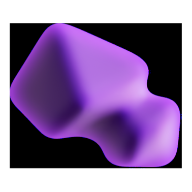

<p align="center">
  
</p>

# FluidDecks

**A modern, highly optimized, and beautifully animated desktop organization utility for Windows.**

---

Say goodbye to the chaotic, cluttered traditional Windows desktop. **FluidDecks** replaces static icons with interactive, beautifully animated "Decks" (widgets) that embed themselves seamlessly into the lowest level of the Windows desktop environment.

Built with **C# and WPF (.NET 10.0)**, FluidDecks brings a modern, tactile feel to your desktop without compromising on system resources or stability.

---

## ✨ Features Showcase

### 🗂️ Intelligent Organization Modes

FluidDecks adapts to your workflow with three primary layout modes:

* **Virtual Decks Mode (Default):** A fully sandboxed virtual folder experience. Drag and drop any file from anywhere in the OS into a virtual deck. The physical files are never moved; instead, a virtual link is instantly created.
* **Mirror Desktop Mode:** A faithful, visually stunning reflection of the physical folders currently existing on your standard desktop.
* **Category Based Mode:** Let FluidDecks do the heavy lifting. This mode automatically categorizes your raw desktop files (Shortcuts, Documents, Images, Archives) into smart, organized decks.

### ⚙️ Crash-Resilient Configuration

Your carefully crafted desktop layout should never be lost to a power outage or app crash.
* **Atomic Saves & Auto-Recovery:** FluidDecks writes all configuration changes to temporary files first before committing them. If a corruption occurs, the engine automatically falls back to an automatically generated `.bak` file.
* **Portability (Import/Export):** Back up your entire layout, virtual folder links, and theme preferences to a single `.json` file. Move it to another PC or share it instantly via the in-app Import/Export feature.
* **Onboarding Experience:** First time using FluidDecks? A beautiful Welcome Screen guides you through the core mechanics (like physics and right-click menus) so you're never lost.

### 🎨 Modern "Glassmorphism" UI

We threw out the sharp, legacy Windows selection boxes. 

* **Purple Translucent Settings:** The completely custom Settings menu uses deep purple tints, rounded corners, and native blur elements to create a premium, 3D fluid aesthetic.
* **Left-Aligned Navigation:** Easily jump between Layout, Appearance, Animations, and Advanced settings using our intuitive sidebar navigation.
* **Dynamic Blur Toggling:** Adjust the frosted glass aesthetic, tint color, and opacity in real-time.

### 🌪️ Tactile Animations & Physics

* **Folder Physics:** Enable the physics engine and literally *throw* your folders across the screen with natural inertia and momentum.
* **Custom Easing:** Choose your favorite click-and-hover animation styles (Smooth Quartic, Snappy Cubic, or Bouncy Back) and tweak the global animation speed multiplier.
* **Dynamic Popup Sizing:** When a deck is clicked, it expands intelligently based on your screen size. If items exceed the limit, an elegant scrollbar seamlessly appears.

### 🚀 Advanced Virtual Deck Capabilities

* **Virtual Renaming:** Rename items inside a Virtual Deck to create a clean visual layout. This alters the "Alias" in the app's configuration and does **not** touch or rename the actual file on your hard drive.
* **Drag-and-Drop Grid Ordering:** Reorder items inside the popup grid by dragging an item and dropping it over another. FluidDecks uses dynamic hit-testing to swap indexes on the fly.
* **Explorer Integration:** Instantly jump to a file's true location via the custom context menu ("Open File Location").

---

## 🛠️ Under the Hood (Technical Architecture)

FluidDecks isn't just a standard "always on bottom" window. It is deeply integrated into the Windows OS to provide a flawless, native-feeling experience:

* **Deep Desktop Embedding:** FluidDecks utilizes Win32 API hooks to attach itself directly to the `Progman` (Program Manager) desktop handle. It becomes part of your wallpaper layer.
* **Win+D Survival:** A notorious issue with Windows desktop widgets is that pressing `Win+D` (Show Desktop) minimizes or glitches them out. FluidDecks intercepts the `WM_SYSCOMMAND` (`SC_MINIMIZE`) signals directly at the `WndProc` level. Result? Your decks stay perfectly glued to the wallpaper, no matter what.
* **Hardware-Accelerated UI:** We utilize native Windows 11 APIs to render hardware-accelerated Mica and Acrylic backdrops, keeping the visual fidelity top-tier without taxing your CPU or RAM.
* **Extreme Performance:** FluidDecks maintains a near-zero resource footprint via lazy loading of high-quality native Windows icons using `SHGetFileInfo`. Memory is only allocated when an icon actually needs to be drawn on your screen.

---

## 🚀 Installation & Build Instructions

### Prerequisites

* Windows 11 (Required for native DWM Mica/Acrylic rendering)
* [.NET 10.0 SDK](https://dotnet.microsoft.com/download) or higher
* Visual Studio 2022 (v17.10+) or JetBrains Rider

### Build from Source

1. **Clone the repository:**
   ```bash
   git clone https://github.com/YourUsername/FluidDecks.git
   cd FluidDecks
   ```

2. **Restore dependencies:**
   ```bash
   dotnet restore
   ```

3. **Build the project:**
   ```bash
   dotnet build -c Release
   ```

4. **Run FluidDecks:**
   ```bash
   dotnet run -c Release
   ```

*(Pre-compiled binaries and an installer will be available in the [Releases](../../releases) tab soon!)*

---

## 🤝 Contributing

**FluidDecks is built by the community, for the community!** Whether you're fixing a bug, adding a new feature, or improving the documentation, your contributions are highly appreciated.

1. Fork the Project
2. Create your Feature Branch (`git checkout -b feature/AmazingFeature`)
3. Commit your Changes (`git commit -m 'Add some AmazingFeature'`)
4. Push to the Branch (`git push origin feature/AmazingFeature`)
5. Open a Pull Request

Please ensure your code follows the existing C# naming conventions and that you test your changes against the `Progman` hook to ensure Win+D stability remains intact.

---

## 📄 License

This project is licensed under the **GNU General Public License v3.0 (GPL v3)**.

Permissions of this strong copyleft license are conditioned on making available complete source code of licensed works and modifications, which include larger works using a licensed work, under the same license. Copyright and license notices must be preserved.

See the [LICENSE](LICENSE) file for more details.
